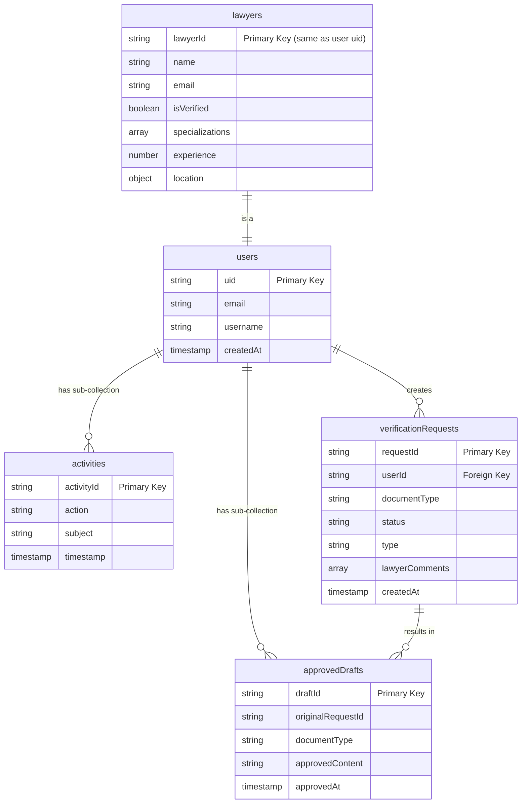

# Firebase Studio

This is a NextJS starter in Firebase Studio.

To get started, take a look at src/app/page.tsx.

---

## Firestore Database Schema

Here is a diagram representing the structure of the Firestore database used in this application.

